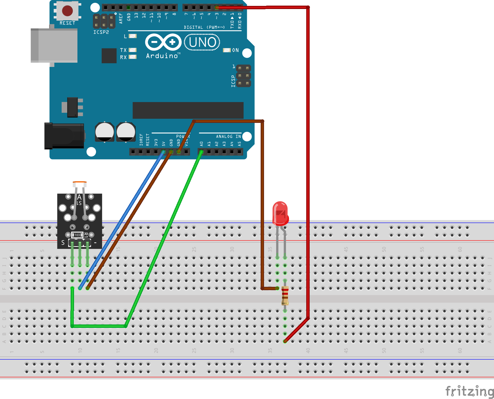
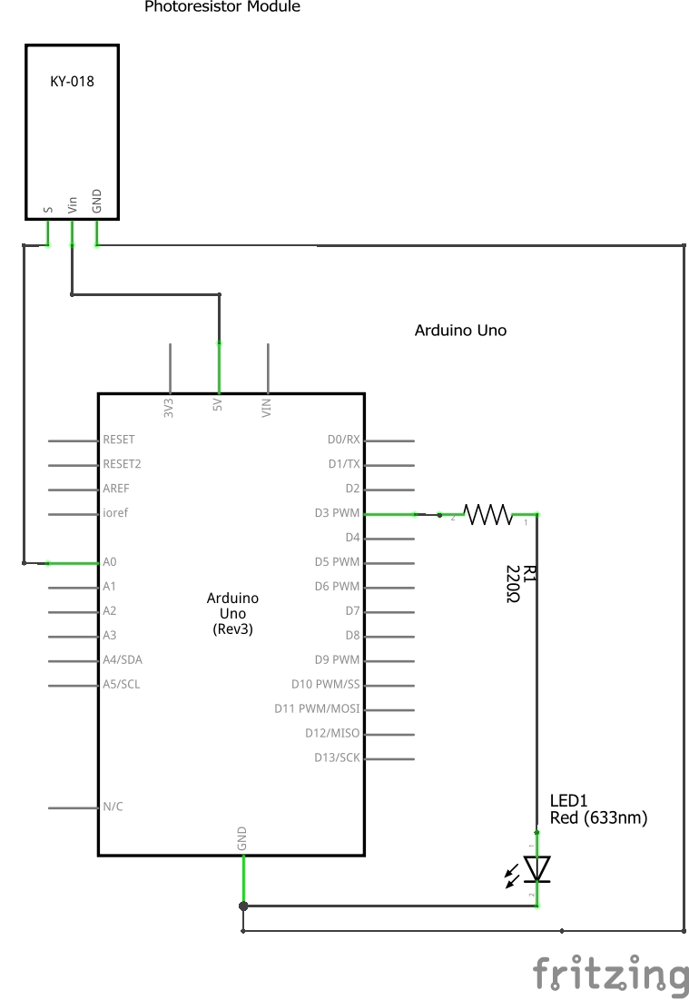

# photoResistorLEDArduino

It's an Arduino Project with a photoresistor and a LED conected. If the photoresistor offers resistance(Ohms) then the LED gets an equivalent value for turn on (with PWM).

## Sketch & Schema

